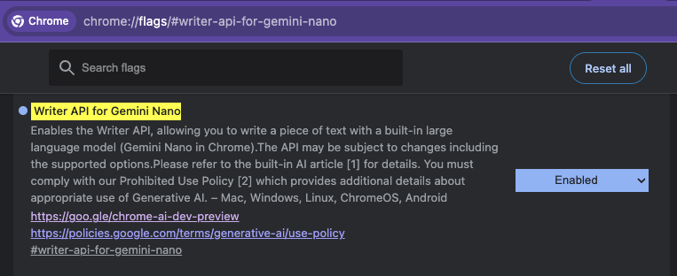

---
# You can also start simply with 'default'
theme: seriph
# random image from a curated Unsplash collection by Anthony
# like them? see https://unsplash.com/collections/94734566/slidev
# some information about your slides (markdown enabled)
title: AI on the Web
info: |
  Presentation slides for developers.

# apply unocss classes to the current slide
class: text-center
# https://sli.dev/features/drawing
drawings:
  persist: false
# slide transition: https://sli.dev/guide/animations.html#slide-transitions
transition: slide-left
# enable MDC Syntax: https://sli.dev/features/mdc
mdc: true
# open graph
# seoMeta:
#  ogImage: https://cover.sli.dev
---

---

---

# AI on the web

Presentation slides for developers
By Yassine Benabbas

<!--
The last comment block of each slide will be treated as slide notes. It will be visible and editable in Presenter Mode along with the slide. [Read more in the docs](https://sli.dev/guide/syntax.html#notes)
-->

---

# Built-in APIs on the web

---

# Writer API

- Sign up for [Origin Trials](https://developer.chrome.com/docs/ai/writer-api#sign_up_for_the_origin_trial)
- Enable on localhost by enabling `chrome://flags/#writer-api-for-gemini-nano`
  

---

# Rewriter API

- `chrome://flags/#rewriter-api-for-gemini-nano`

---

# TypeScript types

`bun install --save-dev @types/dom-chromium-ai`

[@types/dom-chromium-ai](https://www.npmjs.com/package/@types/dom-chromium-ai)

---

---

# Resources and links

- [Meme1](https://imgflip.com/i/a16egd)
- [Meme2](https://imgflip.com/i/a16egj)

<PoweredBySlidev mt-10 />
