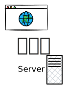

# Conclusion

 
 

  

    
    
Nouvelles possibilités aux applications web

  

  

    
    
Client-side vs server-side : sur le rendu et sur l'IA
 
  

  

    
    
Lib JS disponibles et WEB AI sera une révolution

  

