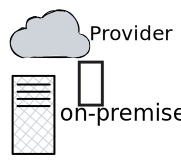
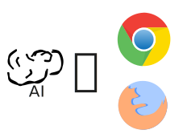

# Conclusion

 
 

  

    
    
L'IA ouvre de nouvelles fonctionnalités pour les applications web

  

  

    
    
Certains cas d'usage peuvent être réalisés par le navigateur
 
  

  

    
    
L'IA côté navigateur est déjà disponible et continue de s'améliorer

  

