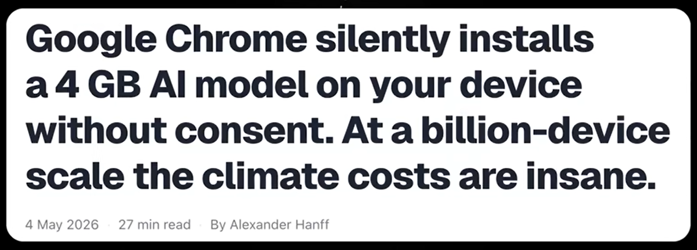
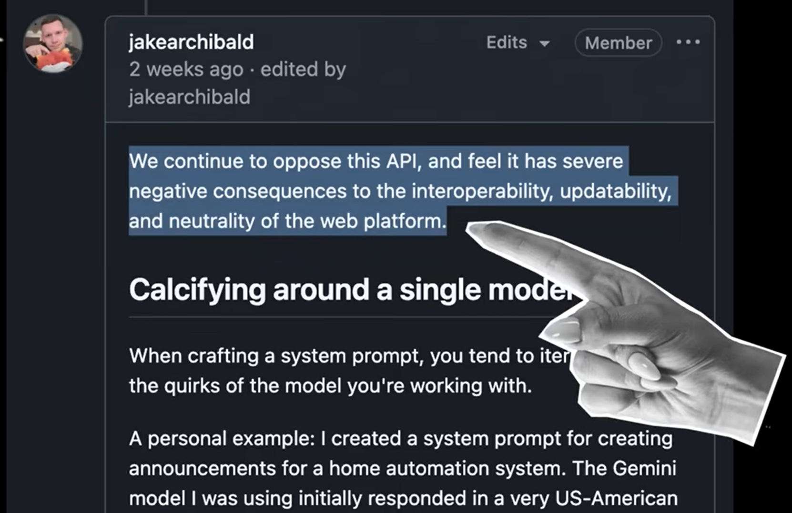
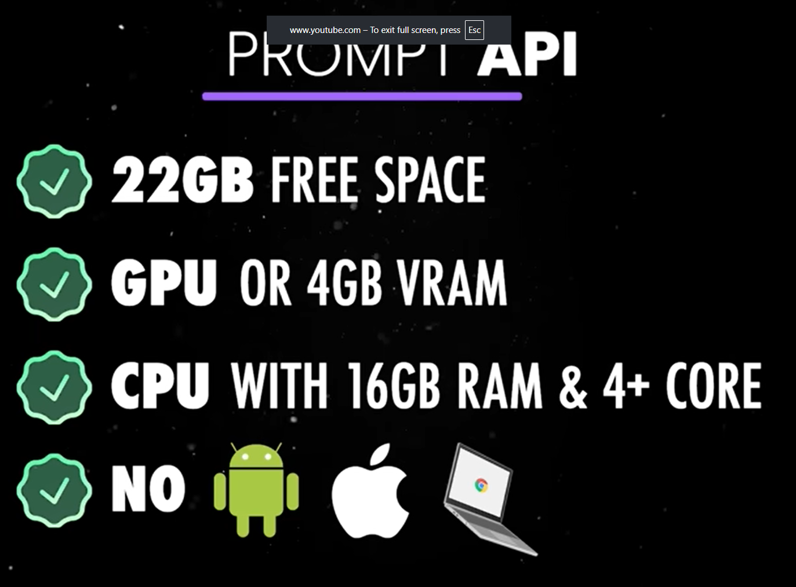

# Web AI

- Standard web
- W3C WebML Working Group
- APIs spécialisées
- En expérimentation sur Chrome: Gemini Nano

---
layout: center
---


---
layout: two-cols-header
---

# APIs WebAI

::left::

- [Summarizer](https://developer.chrome.com/docs/ai/summarizer-api)
- [Language Detection](https://developer.chrome.com/docs/ai/language-detection)
- [Translator](https://developer.chrome.com/docs/ai/translator-api)
- [Prompt](https://developer.chrome.com/docs/ai/prompt-api)

::right::

- [Writer](https://developer.chrome.com/docs/ai/writer-api) <game-icons-vial />
- [Rewriter](https://developer.chrome.com/docs/ai/rewriter-api) <game-icons-vial />
- [Proofreader](https://developer.chrome.com/docs/ai/proofreader-api) <game-icons-vial />

<style>

li {
  font-size: 2em;
}
</style>

---

# Exemple : API Traducteur

```js
// Vérifier si l'API Traducteur est disponible dans le navigateur
if (!("Translator" in window)) return;
// Configurer les options de l'API Traducteur
const options = {
  sourceLanguage: "en",
  targetLanguage: "fr",
};
// Vérifier la disponibilité de l'API Traducteur avec les options données
const availability = await Translator.availability(options);
if (availability === "unavailable") return;
// Créer un objet Traducteur avec les options souhaitées
const translator = await Translator.create(options);
// Demander à l'objet Traducteur de traduire un texte
const result = await translator.translate("Hello, world!");
console.log(result);
// La sortie devrait être : "Bonjour, monde !"
```

---
layout: two-cols-header
srcLeft: ./pages/webai-demo.md
---

# Démo WebAI : chat multilingue

::left::

<iframe src="https://yostane.github.io/web-ai/seamless-international-chat/"></iframe>

::right::

<iframe src="https://yostane.github.io/web-ai/seamless-international-chat/"></iframe>

<style>
  iframe {
    border: none;
    border-radius: 8px;
    padding: 0;
    margin: 0;
    height: 450px;
    width: 350px;
  }  
</style>

---
layout: center
---

# Autres démos

- [Mes démos](https://yostane.github.io/web-ai/)
- [Démos de Chrome](https://chrome.dev/web-ai-demos/)
- [Infos du modème dans chrome://on-device-internals/](chrome://on-device-internals/)

---

# Le revers de la médaille

Source [Awesome](https://www.youtube.com/watch?v=seKv8ZyTiOU)



---
layout: full
---



<style>
  img{
    height: 500px;
  }
</style>

---
layout: center
---



<style>
  img{
    height: 500px;
  }
</style>

---

<Youtube id="seKv8ZyTiOU" style="width:100%;height:100%;" />
