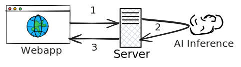
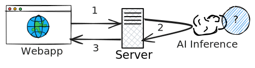
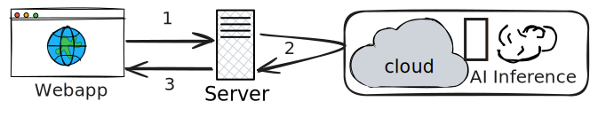
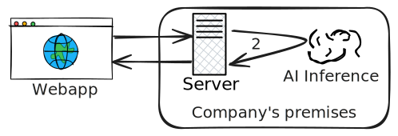
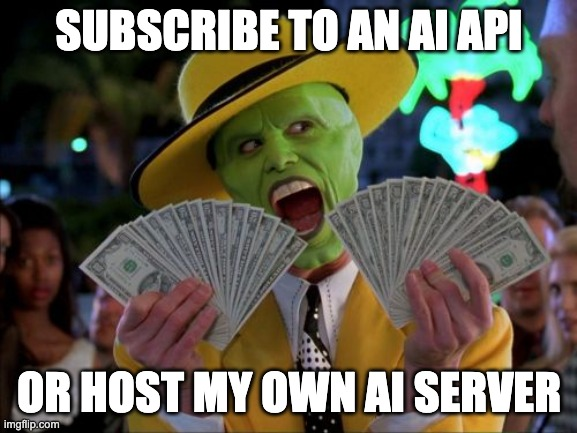

# Introduction

- L'IA permet d'enrichir l'UX dans les applications web
- ChatBots, recommandations personnalisées, traduction, etc.
- Usuellement implémentée côté serveur

---

# IA côté serveur




<v-clicks>

1. L'application web envoie une **requête** au serveur backend.
1. Si une inférence IA est nécessaire, elle est déléguée à un **service IA** séparé.
1. La sortie IA est traitée par le serveur et la réponse finale est renvoyée à l'application web.

</v-clicks>

<p v-click="4" style="color:lightblue"><b>Où est hébergé le service IA ?</b></p>

<style>
.slidev-vclick-hidden {
  display: none;
}

.svgimg {
  width: 100%;
  height: 250px;
}
</style>

---

# Inférence IA via un fournisseur tiers



<br>
<br>
<br>

<v-click>

- **Tarification** : à l'utilisation. Certains proposent des offres gratuites.
- **Fournisseurs** : <logos-google-cloud /> , <logos-aws />, <logos-openai style="background:white; border-radius: 5px; padding: 2px;" />, <logos-microsoft-azure />, etc.

Liste de ressources API LLM gratuites fournie par [cheahjs/free-llm-api-resources](https://github.com/cheahjs/free-llm-api-resources)

</v-click>

<style>
img {
  width: 100%;
  height: 200px;
}
</style>

---

# Démo : Google Cloud AI

- **Outils** : <logos-python /> Langchain et Streamlit

```py
from langchain_google_genai import ChatGoogleGenerativeAI
llm = ChatGoogleGenerativeAI(model="gemini-2.0-flash-lite", api_key=api_key)
system_message = (
    "system", "You are an expert at explaining programming languages' concepts.")
response = llm.invoke([system_message, human_message])
print(response.content)
```

<v-click>

Bibliothèques :

- Bibliothèques et APIs du fournisseur,
- Ou multi-fournisseur : LangChain <logos-python />, LangChain4j <logos-java /> <logos-kotlin-icon />, LangChain.js <logos-javascript /> <logos-typescript-icon />, Koog <logos-kotlin-icon />.

</v-click>

---

# Démo : chat IA avec Streamlit

<div style="display: flex; justify-content: center;">
  <Youtube id="lZBGyJVyIE4" style="width:100%;height:400px;" />
</div>

---

# Inférence IA en local (on-premise)



<br>
<br>

- **Outils** : Ollama, Jan AI, LM Studio, etc.

<style>
img {
  height: 300px;
  width: auto;
}
</style>

---

# Démo : Ollama

Démarrer le serveur Ollama en local avec le modèle gemma3 :

```bash
ollama serve
ollama pull gemma3
```

<logos-javascript /> code du serveur backend qui interroge le serveur Ollama local :

```ts
const ollama = new Ollama({ host: 'http://localhost:11434' })
app.post("/chat", async (req, res) => {
  const question = req.body.question
  const response = await ollama.chat({
      model: 'gemma3',
      messages: [{ role: 'user', content: question }],
  })
  res.json({ answer: response.message.content })
})
```

---
layout: center
---

# Résumé

De l'inférence IA côté serveur

💪 Accès à des modèles puissants et à jour

💰 Coûts de maintenance ou d'abonnement

🔒 Potentiels problèmes de confidentialité

🌐 Dépendance à la connectivité réseau

[Référence : étude Lenovo 2025](https://lenovopress.lenovo.com/lp2225-on-premise-vs-cloud-generative-ai-total-cost-of-ownership)

---
layout: center
---



---
layout: fact
---

# Et si on pouvait se passer du serveur ?

---
layout: fact
---

# Et si on pouvait se passer du serveur ?*

*Sur certains cas d'usage.