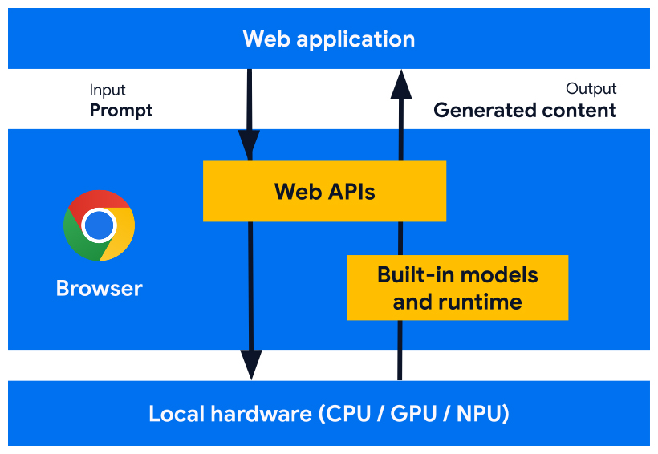

# Web AI

- Standard web
- W3C WebML Working Group
- APIs spécialisées
- En expérimentation sur Chrome: Gemini Nano

---
layout: center
---



---
layout: center
---

# API disponibles

- Création de sommaires
- Traduction
- Détection de langue
- Correction orthographique
- Rédaction de texte
- Révision de texte
- Prompting

---

# Exemple : API Traducteur

```js
// Vérifier si l'API Traducteur est disponible dans le navigateur
if (!('Translator' in window)) return;
// Configurer les options de l'API Traducteur
const options = {
  sourceLanguage: 'en',
  targetLanguage: 'fr',
};
// Vérifier la disponibilité de l'API Traducteur avec les options données
const availability = await Translator.availability(options);
if (availability === 'unavailable') return;
// Créer un objet Traducteur avec les options souhaitées
const translator = await Translator.create(options);
// Demander à l'objet Traducteur de traduire un texte
const result = await translator.translate('Hello, world!');
console.log(result);
// La sortie devrait être : "Bonjour, monde !"
```

---
layout: center
---

# Démos

- [Mes démos](https://yostane.github.io/web-ai/)
- [Démos de Chrome](https://chrome.dev/web-ai-demos/)
- [Infos du modème dans chrome://on-device-internals/](chrome://on-device-internals/)

---
layout: two-cols-header
srcLeft: ./pages/webai-demo.md
---

# Démo WebAI : chat multilingue

::left::

<iframe src="https://yostane.github.io/web-ai/seamless-international-chat/"></iframe>

::right::

<iframe src="https://yostane.github.io/web-ai/seamless-international-chat/"></iframe>

<style>
  iframe {
    border: none;
    border-radius: 8px;
    padding: 0;
    margin: 0;
    height: 450px;
    width: 350px;
  }  
</style>
