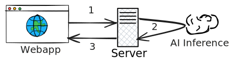
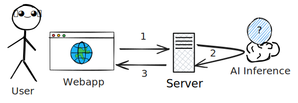
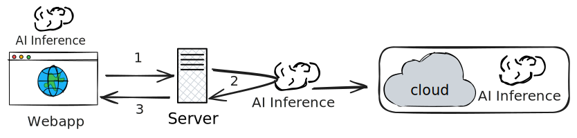
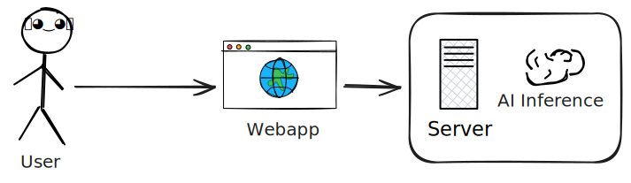

# Server-side AI inference




<br>
<br>

1. The web app send a request to the backend server
1. If AI inference is needed, it is delegated to a separate AI service
1. AI output is processed by the server and the final response is sent back to the web app

<br>

<div v-after><b>What is the AI service?</b></div>

<style>
.slidev-vclick-hidden {
display: none;
}
</style>

---

## AI inference on the Cloud



<br>
<br>

**Providers**: GoogleAI, OpenAI, Anthropic, etc.

---
layout: center
zoom: 1.5
---

## Example with Google Cloud AI

```py
from langchain_google_genai import ChatGoogleGenerativeAI
llm = ChatGoogleGenerativeAI(model="gemini-2.0-flash-lite", api_key=api_key)
system_message = (
    "system", "You are an expert at explaining programming languages' concepts.")
response = llm.invoke([system_message, human_message])
print(response.content)
```

A free API key can be obtained from [aistudio.google.com](https://aistudio.google.com/api-keys)

<style>
pre {
  display: flex;
  align-items: center;
  justify-content: center;
}
</style>

---

# AI inference on-premise



- Tools: Llama.cpp, Ollama, etc.
- Pros: More control, no ongoing costs
- Cons: Infrastructure costs, maintenance

---
layout: center
hideInToc: true
---


