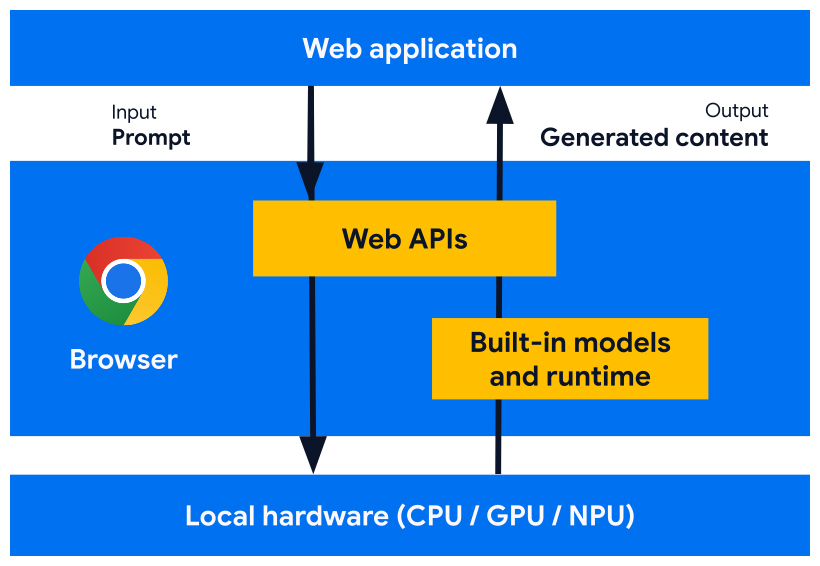

# Web AI: W3C WebML Working Group

<div class="grid grid-cols-[1fr_600px] gap-2">
  <div style="align-self: center; justify-self: center;">
    <ul>
      <li>Web standard</li>
      <li>Specialized APIs</li>
      <li>Text generation</li>
      <li>Exp. on Chrome</li>
    </ul>
  </div>
  <div>
    
  </div>
</div>

---

# Example: Translator API

```js
// Check if the Translator API is available in the browser
if (!("Translator" in window)) return;
// Set up the options for the Translator API
const options = {
  sourceLanguage: "en",
  targetLanguage: "fr",
};
// Check the availability of the Translator API with the given options
const availability = await Translator.availability(options);
if (availability === "unavailable") return;
// Create a Translator object with the desired options
const translator = await Translator.create(options);
// Ask the Translator object to translate a text
const result = await translator.translate("Hello, world!");
console.log(result);
// The output should be: "Bonjour, monde !"
```

---
layout: two-cols-header
srcLeft: ./pages/webai-demo.md
---

# WebAI demo: Seamless chat

::left::

<iframe src="https://yostane.github.io/web-ai/seamless-international-chat/"></iframe>

::right::

<iframe src="https://yostane.github.io/web-ai/seamless-international-chat/"></iframe>

<style>
  iframe {
    border: none;
    border-radius: 8px;
    padding: 0;
    margin: 0;
    height: 450px;
    width: 350px;
  }  
</style>
