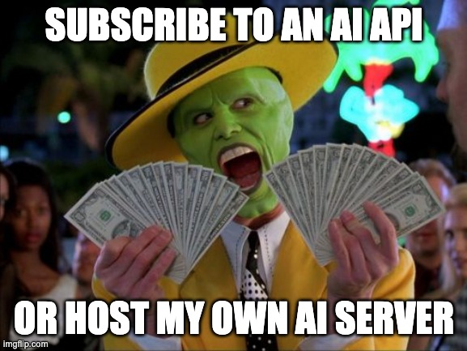

- Live translation
- Image processing
- Summarization

---
layout: center
hideInToc: true
---

---
layout: cover
hideInToc: true
---

# GenAI for webapps

Where we're at

GenerationAI Paris. December 9, 2025

---
layout: image-right
image: ./assets/speaker.jpg
hideInToc: true
---

# Speaker

- Yassine Benabbas
- DevRel @ Worldline
- Teacher
- Lille Android User Group
- SNs: @yostane
- LinkedIn: **in/yassinebenabbas/**
- Anime, Pokémon TCG

---
hideInToc: true
---

# Agenda

<Toc minDepth="1" maxDepth="2" />

---
src: ./pages/serverai.md
---

# AI inference in the browser

- Libraries: transformers.js, openvsc.js, web AI APIs
- Pros: Privacy, low latency, no server costs
- Cons: Limited model size, device capabilities

---
src: ./pages/transformersjs.md
---

---
src: ./pages/opencvjs.md
---

---
src: ./pages/webai.md
---

# Browser AI vs server AI

| Criteria                     | Browser AI                          | Server AI                                |
| ---------------------------- | ----------------------------------- | ---------------------------------------- |
| Privacy                      | 🏆 Data stays in the device         | Data sent to server                      |
| Latency                      | 🏆 No network delay                 | Network latency                          |
| Cost                         | 🏆 No server costs                  | Ongoing server costs                     |
| Scalability                  | Limited by user device capabilities | 🏆 Easily scalable with server resources |
| Supported Models / use-cases | Limited                             | 🏆 Wide variety of models available      |

---

---

# Learn More

<PoweredBySlidev mt-10 />
