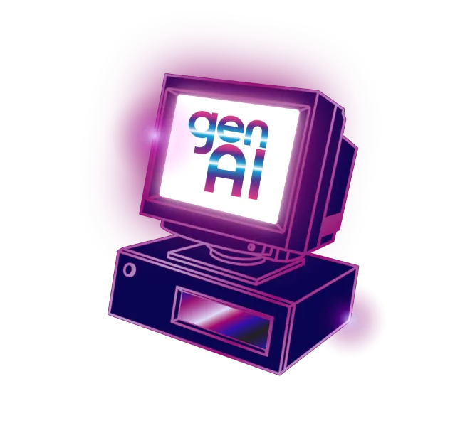
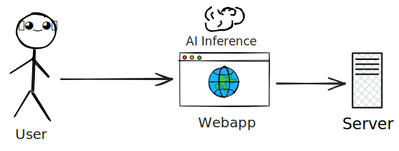

  

    
    
    
  

  

    

      <twemoji-writing-hand class="text-3xl"/>
      <ul style="list-style: none;" class="mt-4">
        <li>Summarization</li>
        <li>Translation</li>
      </ul>
    

    

      <twemoji-framed-picture class="text-3xl"/>
      <ul style="list-style: none;" class="mt-4">
        <li>Background removal</li>
        <li>Face detection</li>
      </ul>
    

    

      <twemoji-studio-microphone class="text-3xl"/>
      <ul style="list-style: none;" class="mt-4">
        <li>Text to speech</li>
        <li>Speech recognition</li>
      </ul>
    

  

---
layout: center
---

---
layout: cover
---

# (Gen)AI for Web Apps

Where we're at

December 9, 2025

---
src: ./pages/bio.md
---

---
layout: two-cols
---

# Agenda <twemoji-spiral-calendar />

<Toc minDepth="1" maxDepth="1" />

::right::

---
src: ./pages/serverai.md
---

---
hideInToc: false
---

# AI inference in the browser

 

**Libraries**: transformers.js, OpenCV.js, Built-in Web AI APIs.

---
src: ./pages/transformersjs.md
---

---
src: ./pages/opencvjs.md
---

---
src: ./pages/webai.md
---

---
layout: center
---

---

# Browser AI vs server AI

 
 

<v-clicks>

| Criteria           | Browser AI                          | Server AI                                |
| ------------------ | ----------------------------------- | ---------------------------------------- |
| Privacy            | 🏆 Data stays in the device         | Data sent to server                      |
| Cost               | 🏆 No server costs                  | Subscription or ongoing server costs     |
| Scalability        | Limited by user device capabilities | 🏆 Easily scalable with server resources |
| Models / use-cases | Limited                             | 🏆 Wide variety of models available      |

</v-clicks>

---
src: ./pages/conclusion.md
---

---
layout: end
---

# Thank you 😊

Any Questions?

<QRCode
    :width="270"
    :height="270"
    type="svg"
    data="https://wrl.li/genai-paris25"
    :imageOptions="{ margin: 5 }"
    :dotsOptions="{ type: 'extra-rounded', color: 'white' }"
    image="worldline-mint-symbol.png"
/>

[wrl.li/genai-paris25](https://wrl.li/genai-paris25) <iconoir-presentation /> - [yostane/web-ai](https://github.com/yostane/web-ai/tree/main/samples) <logos-github-icon style="background:white; border-radius: 5px; padding:1px" /> 
 
Credits: Tenor, Chrome for developers, <PoweredBySlidev mt-5 />